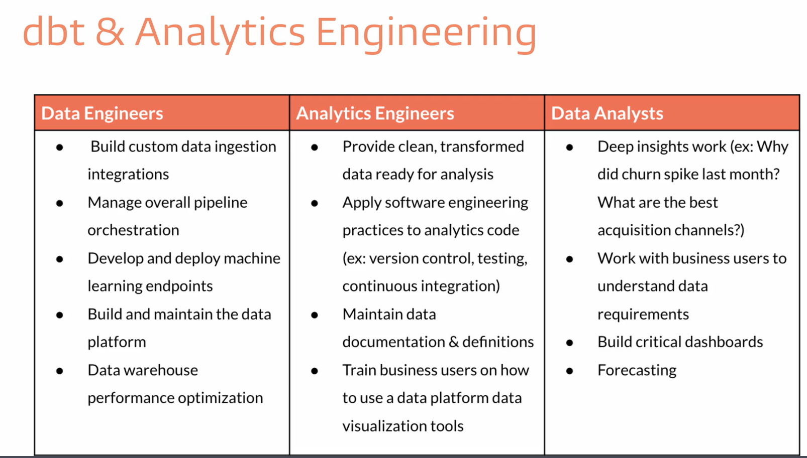

## Fundamentos do dbt

### Cinco tópicos/definições importantes
- sources
- models
- tests
- docs
- deployment

Itens básicos do desenvolvimento de um workflow

## dbt & Analytics Engineering

Grupo do trabalho
Aluno: Arthur Fernandes Nascimento da Silva RA: 24.85954-8

Descrição do Pipeline de Dados de Usuários

O pipeline de dados foi desenvolvido para processar e enriquecer informações de usuários a partir de um arquivo CSV, transformando-as em três camadas distintas (Bronze, Silver e Gold) dentro do Data Warehouse (PostgreSQL) com o auxílio da ferramenta dbt.

Camada Bronze (Ingestão): Os dados brutos, contendo id_usuario, nome_completo, email, cidade, idade, profissao e renda_mensal, são carregados do arquivo usuarios.csv para a tabela usuarios via dbt seed. Esta camada é a representação fiel dos dados na origem.

Camada Silver (Transformação e Enriquecimento): O modelo slv_usuarios consome os dados da camada Bronze e aplica as seguintes transformações:

Limpeza: Trata valores nulos nos campos email e renda_mensal.

Enriquecimento: Divide o nome_completo em primeiro_nome e ultimo_nome.

Padronização: Converte o campo cidade para letras minúsculas.

Criação de Features: Adiciona a coluna faixa_renda (Baixa, Média, Alta) com base no valor da renda_mensal, criando uma categorização para análises.

Camada Gold (Agregação para Análise): Esta camada final contém modelos agregados, prontos para consumo por ferramentas de BI e análise:

gld_contagem_usuarios_cidade: Tabela que resume o número total de usuários por cidade.

gld_analise_renda_profissao: Um novo modelo analítico que calcula a renda média, mínima e máxima, além do número de profissionais por profissao, fornecendo insights sobre o perfil de renda de cada carreira.

### Resources:
- Learn more about dbt [in the docs](https://docs.getdbt.com/docs/introduction)
- Check out [Discourse](https://discourse.getdbt.com/) for commonly asked questions and answers
- Join the [chat](https://community.getdbt.com/) on Slack for live discussions and support
- Find [dbt events](https://events.getdbt.com) near you
- Check out [the blog](https://blog.getdbt.com/) for the latest news on dbt's development and best practices
